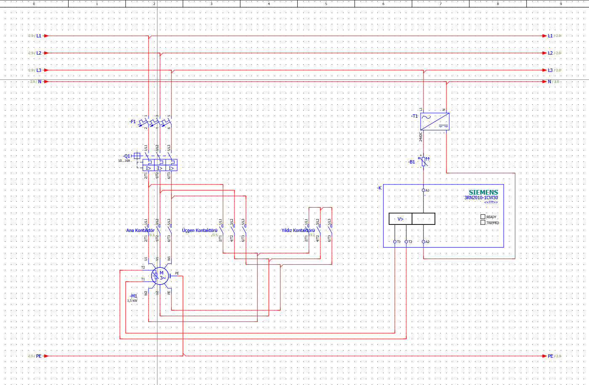
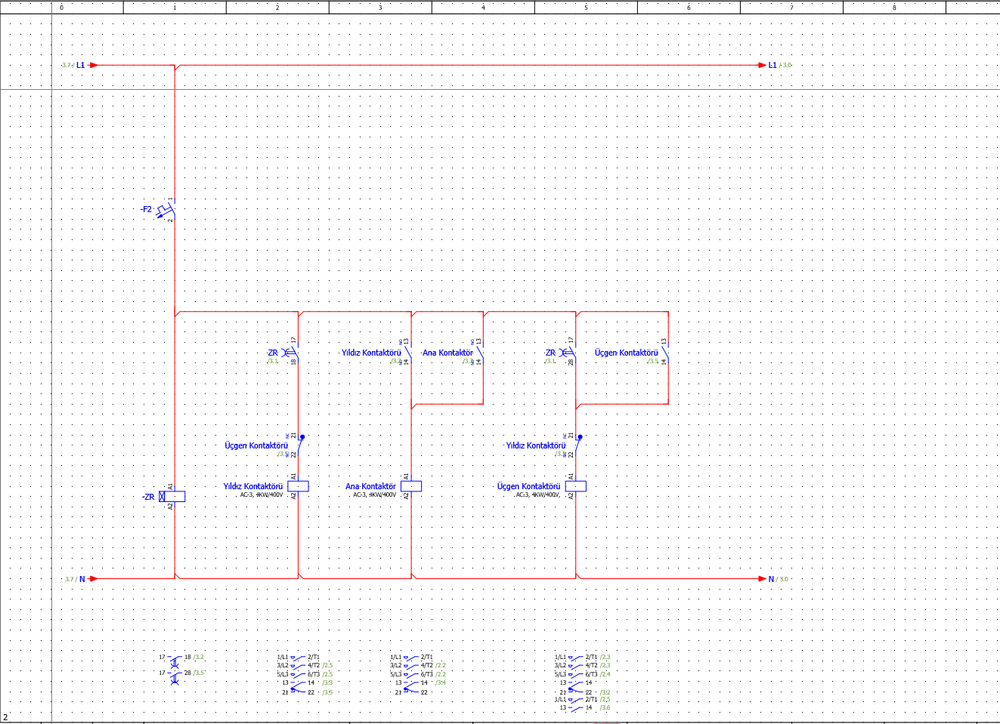

# Yıldız-Üçgen Motor Yol Verme Projesi

Bu proje, üç fazlı asenkron motorun yıldız-üçgen yol verme yöntemiyle çalıştırılmasına yönelik olarak EPLAN Electric P8 ortamında hazırlanmıştır. Projede güç ve kumanda devreleri oluşturulmuş, motorun yıldız bağlantıdan üçgen bağlantıya zaman kontrollü olarak geçişi tasarlanmıştır.

## Projenin Amacı

Yıldız-üçgen yol verme yöntemi kullanılarak asenkron motorun kalkış akımının sınırlandırılması ve belirlenen süre sonunda motorun üçgen bağlantıda normal çalışmasına geçmesi amaçlanmıştır.

## Kullanılan Ekipmanlar

- Üç fazlı asenkron motor
- Ana kontaktör
- Yıldız kontaktörü
- Üçgen kontaktörü
- Siemens yıldız-üçgen zaman rölesi
- Siemens termistör motor koruma rölesi
- Motor koruma şalteri
- Sigortalar
- 24 V DC güç kaynağı

## Çalışma Prensibi

Sistem devreye alındığında yıldız ve ana kontaktörler enerjilenerek motor yıldız bağlantıda çalışmaya başlar. Zaman rölesinde ayarlanan süre sonunda yıldız kontaktörü devreden çıkar. Kısa geçiş süresinin ardından üçgen kontaktörü devreye girer ve motor üçgen bağlantıda çalışmaya devam eder.

Yıldız ve üçgen kontaktörlerinin aynı anda devreye girmesini önlemek amacıyla kumanda devresinde elektriksel kilitleme uygulanmıştır.

## Güç Devresi

Aşağıdaki şemada motorun ana, yıldız ve üçgen kontaktörleri üzerinden gerçekleştirilen güç bağlantıları gösterilmektedir.

## Kumanda Devresi

Kumanda devresinde zaman rölesi ile yıldız-üçgen geçişi sağlanmış ve kontaktörler arasında elektriksel kilitleme uygulanmıştır.

## Kullanılan Yazılım

- EPLAN Electric P8

## Proje Dosyası

Repository içerisinde EPLAN Electric P8 ile hazırlanmış proje dosyası (`.elk`) bulunmaktadır.
